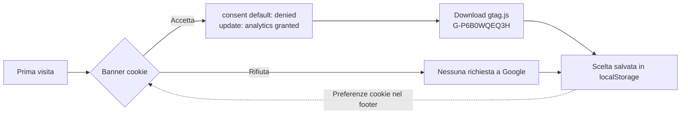
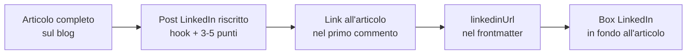
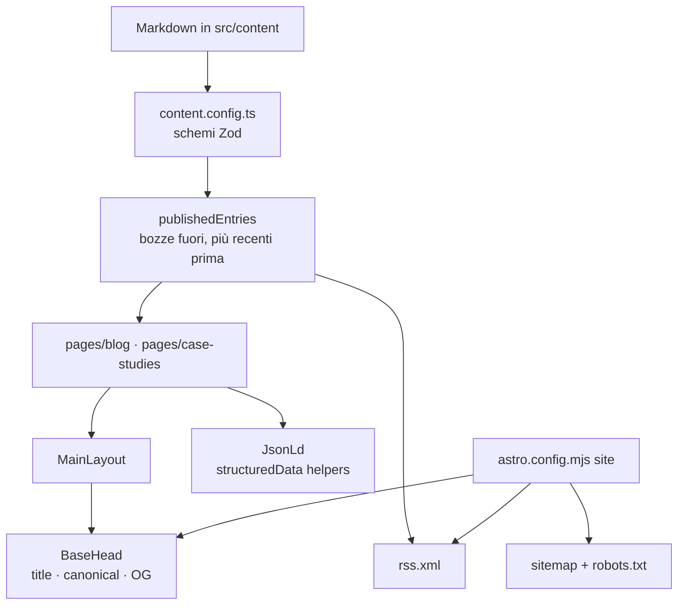

<div align="center">

# Elia Giolli · Portfolio

**Da front-end developer a Technical SEO & Analytics specialist**

Il sito con cui racconto il passaggio dallo sviluppo web alla SEO tecnica e alla web analytics:
case studies documentati, un blog che alimenta LinkedIn e un portfolio che applica a sé stesso tutto quello che predica.

[](https://elia-giolli-portfolio-astro.vercel.app/)

<a href="https://skillicons.dev"></a>


</div>

---

## 📑 Indice

- [🎯 Il posizionamento](#-il-posizionamento)
- [✨ Cosa c'è nel sito](#-cosa-cè-nel-sito)
- [📈 Marketing, SEO e analytics](#-marketing-seo-e-analytics)
- [🏗️ Architettura](#️-architettura)
- [✍️ Pubblicare contenuti](#️-pubblicare-contenuti)
- [🚀 Avvio locale](#-avvio-locale)
- [⚙️ Configurazione](#️-configurazione)
- [🧪 Test](#-test)
- [♿ Accessibilità](#-accessibilità)

---

## 🎯 Il posizionamento

Ispirato al modello "X turned Y", reso in italiano come **"Da front-end developer a Technical SEO & Analytics specialist"**.
I ruoli restano in inglese perché sono le parole chiave usate da recruiter e annunci.

| | |
| --- | --- |
| 🧑‍💻 **Da dove vengo** | Sviluppo front-end, supporto IT enterprise, laurea in Lingue (5 lingue straniere) |
| 🔍 **Dove vado** | SEO tecnica e web analytics: indicizzazione, Core Web Vitals, dati strutturati, GA4, Search Console |
| 🎓 **Formazione** | HubSpot Academy *Digital Marketing* + base tecnica Cisco (reti e sicurezza) |
| 🧪 **Prova sul campo** | Il portfolio stesso: il primo case study è l'audit SEO di questo sito |

---

## ✨ Cosa c'è nel sito

| Pagina | Route | Cosa contiene |
| --- | --- | --- |
| 🏠 Home | `/` | Hero, profilo, case studies, certificazioni, ultimi articoli, contatti |
| 📝 Blog | `/blog/` · `/blog/<slug>/` | Articoli su SEO tecnica e analytics, con tempo di lettura e rimando a LinkedIn |
| 📊 Case studies | `/case-studies/` · `/case-studies/<slug>/` | Sfida → approccio → risultato, più il racconto completo |
| 📄 CV | `/cv/` | Curriculum stampabile con layout dedicato |
| 🍪 Privacy | `/privacy/` | Informativa privacy e cookie |
| 📡 RSS | `/rss.xml` | Feed degli articoli |
| 🤖 SEO | `/robots.txt` · `/sitemap-index.xml` | Generati a ogni build |

---

## 📈 Marketing, SEO e analytics

### 🔎 SEO tecnica

| Area | Implementazione | Dove |
| --- | --- | --- |
| Dominio unico | `site` in `astro.config.mjs` alimenta canonical, sitemap, robots, RSS e Open Graph | `astro.config.mjs` |
| Metadati | Title e description per pagina, canonical con slash finale, meta robots (`noindex` sulla 404) | `src/shared/components/BaseHead.astro` |
| Anteprime social | Open Graph + Twitter Card, immagine 1200×630 | `public/og-image.png` |
| Indicizzazione | Sitemap con `@astrojs/sitemap`, robots.txt generato dalla config | `src/pages/robots.txt.ts` |
| Dati strutturati | `Person` (home), `BlogPosting` (articoli), `BreadcrumbList` (blog, case studies, privacy) | `src/helpers/structuredData.ts` |
| Link interni | Breadcrumb visibili + JSON-LD, articoli collegati tra loro e al case study | `src/shared/components/Breadcrumbs.astro` |
| Bozze | `draft: true` visibile solo in sviluppo, mai in produzione | `src/helpers/publishedEntries.ts` |

### ⚡ Core Web Vitals

- **LCP**: Noto Sans caricato con `<link>` + `preconnect` invece di `@import` nel CSS.
- **CLS**: immagini convertite in WebP da Astro con `width`/`height` espliciti e `srcset`.
- **INP / peso JS**: Alpine.js per l'interattività, nessuno script di terze parti prima del consenso.
- **Navigazione**: prefetch dei link interni al passaggio del mouse.

### 📊 Analytics e privacy

**Google Analytics 4** con **Consent Mode v2 "basic"**: `gtag.js` non viene nemmeno scaricato finché il visitatore non clicca *Accetta*.



| Strumento | Configurazione |
| --- | --- |
|  | ID `G-P6B0WQEQ3H`, attivo **solo nelle build di produzione** (le visite da `astro dev` non sporcano i dati) |
|  | Proprietà *Prefisso URL*, verificata con il tag HTML; sitemap inviata; collegata a GA4 |
| 🍪 Banner | Componente Alpine.js, logica in `src/helpers/analyticsConsent.ts`, link "Preferenze cookie" nel footer |

> Il controllo automatico di GA4 segnala "tag non rilevato": è atteso, perché il tag compare solo dopo il consenso. La verifica si fa dal report **Tempo reale**.

### 🔁 Content strategy: dal blog a LinkedIn



Ogni articolo chiude con un box che rimanda al post LinkedIn (o al profilo, se il post non c'è ancora) e, idealmente, con una domanda al lettore per stimolare i commenti.

---

## 🏗️ Architettura

### 🧰 Stack

| | Tecnologia | Ruolo |
| --- | --- | --- |
|  | [Astro](https://astro.build/) | Rendering statico, routing, content collections, ottimizzazione immagini |
|  | [Tailwind CSS](https://tailwindcss.com/) | Sistema visuale e layout responsive |
|  | [Alpine.js](https://alpinejs.dev/) | Menu mobile, tab delle certificazioni, banner cookie |
|  | TypeScript | Helpers, schemi dei contenuti, contratti dei componenti |
|  | Content collections | `blog` e `caseStudies` con schema Zod |
|  | [Vercel](https://vercel.com/) | Hosting e deploy automatico da `main` |
|  | [Vitest](https://vitest.dev/) + jsdom | Test unitari e di integrazione |
|  | [Playwright](https://playwright.dev/) | Test end-to-end su Chromium |

Integrazioni: `@astrojs/sitemap`, `@astrojs/rss`, `sharp`, [EmailJS](https://www.emailjs.com/) (form contatti), `class-variance-authority` + `tailwind-merge` (varianti UI).

### 🗂️ Struttura

Organizzazione **feature-based**: ogni area del sito ha la sua cartella, la logica pura sta in `helpers/` (testata accanto al codice), la UI condivisa in `shared/`.

```text
├── astro.config.mjs            # site, sitemap, prefetch, Tailwind
├── vitest.config.ts            # progetti "unit" e "integration"
├── playwright.config.ts        # e2e sulla build di produzione
├── public/                     # favicon, logo, og-image.png
├── src/
│   ├── content/
│   │   ├── blog/               # articoli Markdown
│   │   └── case-studies/       # case studies Markdown
│   ├── content.config.ts       # schemi Zod delle collection
│   ├── assets/blog/            # screenshot degli articoli (ottimizzati da Astro)
│   ├── core/layouts/           # MainLayout, CvLayout
│   ├── features/
│   │   ├── home/               # HeroSection, AboutSection
│   │   ├── case-studies/       # sezione home, card, step sfida/approccio/risultato
│   │   ├── blog/               # PostCard, PostMeta, LinkedInCallout, LatestPostsSection
│   │   ├── certificates/       # dati in certificates.ts + tab accessibili
│   │   ├── contact/            # form EmailJS
│   │   └── cv/
│   ├── helpers/                # logica pura + *.test.ts
│   │   ├── seo.ts              # title e canonical
│   │   ├── structuredData.ts   # Person, BlogPosting, BreadcrumbList
│   │   ├── analyticsConsent.ts # GA4 + Consent Mode v2
│   │   ├── publishedEntries.ts # bozze e ordinamento
│   │   ├── readingTime.ts · navigation.ts · formatDate.ts …
│   ├── pages/                  # route + robots.txt.ts + rss.xml.ts
│   ├── shared/
│   │   ├── components/         # BaseHead, Navbar, NavLink, Footer, CookieConsent,
│   │   │                       # Breadcrumbs, JsonLd, PageHeader, SectionHeading, SkipLink
│   │   ├── forms/ · ui/        # Form, Input, Button, Card, TagList
│   │   ├── lib/                # alpine.ts (bootstrap unico), cn.ts
│   │   └── utils/              # constants.ts, analytics.ts, variants.ts
│   └── styles/global.css       # Tailwind + .prose-document per i contenuti lunghi
└── tests/
    ├── integration/            # build + analisi dell'HTML generato
    └── e2e/                    # Playwright
```

### 🔄 Flusso dei dati



---

## ✍️ Pubblicare contenuti

### 📝 Un articolo

Crea `src/content/blog/<slug>.md`: il nome del file diventa l'URL `/blog/<slug>/`.

```md
---
title: "Titolo (50-60 caratteri)"
description: "Meta description, massimo 170 caratteri."
pubDate: 2026-10-06
updatedDate: 2026-10-20        # opzionale
tags: ["Technical SEO", "GA4"] # il primo tag compare come etichetta
linkedinUrl: "https://www.linkedin.com/posts/..."  # opzionale, dopo il repurposing
cover: "./cover.jpg"           # opzionale, richiede coverAlt
coverAlt: "Descrizione dell'immagine"
draft: true                    # visibile solo in `astro dev`
---

Testo in Markdown. Usa titoli `##` e `###` (l'`h1` è il title).


*Didascalia in corsivo subito sotto l'immagine.*
```

### 📊 Un case study

`src/content/case-studies/<slug>.md` con `title`, `description`, `pubDate`, `tags`, i tre step `challenge` · `approach` · `result` e, opzionali, `githubUrl` e `liveUrl`.

### 🎓 Una certificazione

Aggiungi l'immagine in `src/features/certificates/assets/` e una voce in `src/features/certificates/certificates.ts` (opzionale `verifyUrl`).

---

## 🚀 Avvio locale

Requisiti: 

```sh
npm install
npx astro dev --background   # http://localhost:4321
```

| Comando | Scopo |
| --- | --- |
| `npm run dev` | Server di sviluppo in primo piano |
| `npx astro dev --background` · `stop` · `status` · `logs` | Server di sviluppo in background |
| `npm run build` | Build statica di produzione in `dist/` |
| `npm run preview` | Serve la build locale |
| `npm test` | Tutte le suite di test |

---

## ⚙️ Configurazione

I valori pubblici del sito stanno in `src/shared/utils/constants.ts`; le variabili d'ambiente servono solo come override.

| Valore | Dove | Note |
| --- | --- | --- |
| Dominio di produzione | `astro.config.mjs` → `site` | Da aggiornare se si passa a un dominio personale |
| Tagline, ruolo, descrizione | `constants.ts` → `SITE_TAGLINE`, `JOB_TITLE`, `SITE_DESCRIPTION` | Usati in hero, title, footer, CV, JSON-LD |
| ID GA4 | `constants.ts` → `GA_MEASUREMENT_ID` | Override: `PUBLIC_GA_MEASUREMENT_ID` |
| Verifica Search Console | `constants.ts` → `GOOGLE_SITE_VERIFICATION` | Override: `PUBLIC_GOOGLE_SITE_VERIFICATION` |
| EmailJS | `PUBLIC_EMAILJS_SERVICE_ID` · `_TEMPLATE_ID` · `_PUBLIC_KEY` | Senza, il form usa il fallback `mailto:` |

Il template EmailJS deve prevedere i campi `from_name`, `reply_to`, `subject` e `message`. Vedi `.env.example`.

---

## 🧪 Test


| Comando | Cosa verifica |
| --- | --- |
| `npm run test:unit` | Helpers e utility, file `*.test.ts` accanto al codice che testano |
| `npm run test:integration` | Una build di produzione, poi jsdom su ogni pagina: SEO, JSON-LD, accessibilità, link, contenuti, GDPR |
| `npm run test:e2e` | Build + Playwright su Chromium contro la build servita in locale |
| `npm test` | Tutte e tre in sequenza |

Prima volta su una nuova macchina: `npx playwright install chromium`.

```text
src/**/*.test.ts            # unit: seo, structuredData, readingTime, publishedEntries,
                            #       navigation, formatDate, analyticsConsent, cn…
tests/
├── integration/
│   ├── setup/buildSite.ts  # una sola `astro build` per tutta la suite
│   ├── utils/dist.ts       # lettura e parsing delle pagine in dist/
│   ├── seo.test.ts         # route, robots, sitemap, RSS, title/description/canonical/OG
│   ├── structuredData.test.ts
│   ├── accessibility.test.ts
│   ├── links.test.ts       # nessun link interno o ancora rotta
│   └── content.test.ts     # home, blog, case study, CV, GDPR
└── e2e/
    ├── fixtures.ts         # blocca ogni richiesta a Google: i test non toccano GA4
    ├── server.mjs          # serve dist/ in primo piano per Playwright
    ├── navigation.spec.ts  # navbar, menu mobile, skip link, 404
    ├── consent.spec.ts     # banner cookie e GA4 solo dopo il consenso
    └── content.spec.ts     # blog, case study, tab certificazioni, form contatti
```

---

## ♿ Accessibilità

- 🧭 Landmark semantici, **un solo `h1`** e un unico `<main>` per pagina, gerarchia dei titoli senza salti.
- ⌨️ Skip link "Vai al contenuto principale", focus visibile, tab delle certificazioni navigabili con le frecce, menu mobile chiudibile con Esc.
- 🏷️ `aria-current` sulla voce di menu attiva, relazioni ARIA verificate dai test di integrazione.
- 🖼️ Testo alternativo su tutte le immagini, dimensioni esplicite.
- 🎞️ Supporto a `prefers-reduced-motion` nello smooth scroll.

---

<div align="center">

[](https://www.linkedin.com/in/eliagiolli/)
[](https://github.com/EliaGiolli)

</div>
