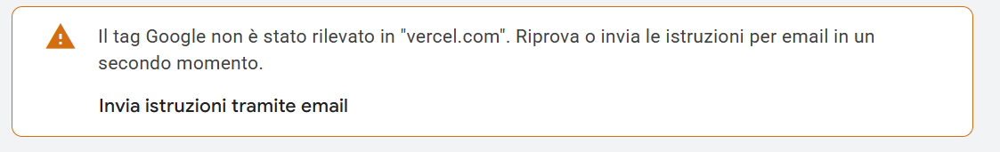
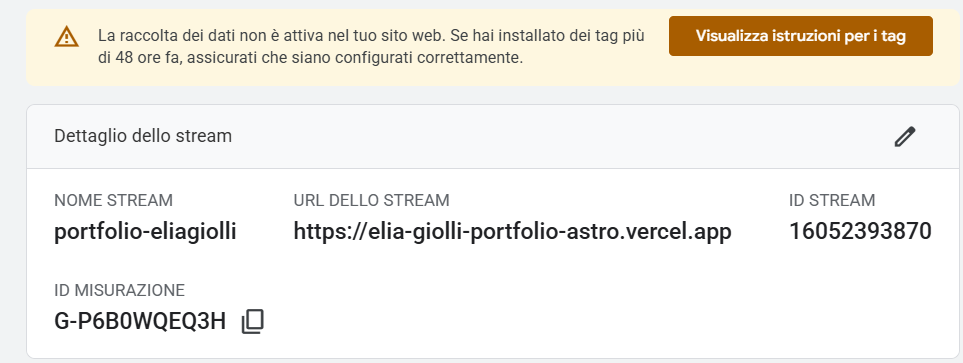
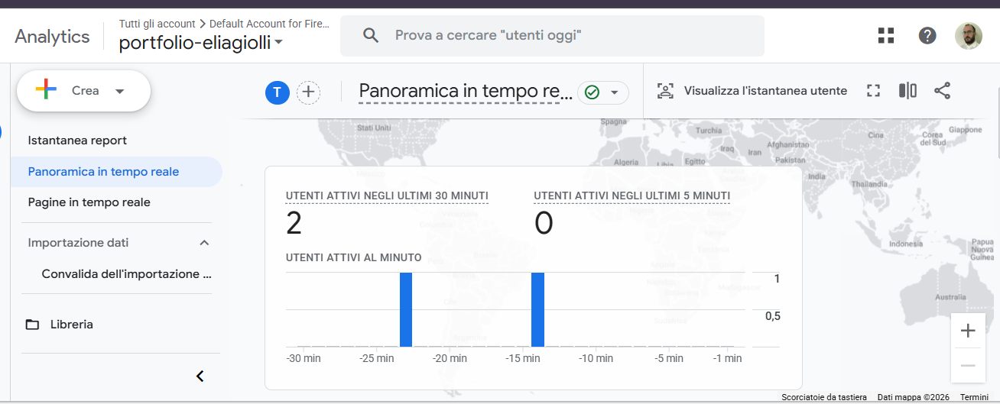
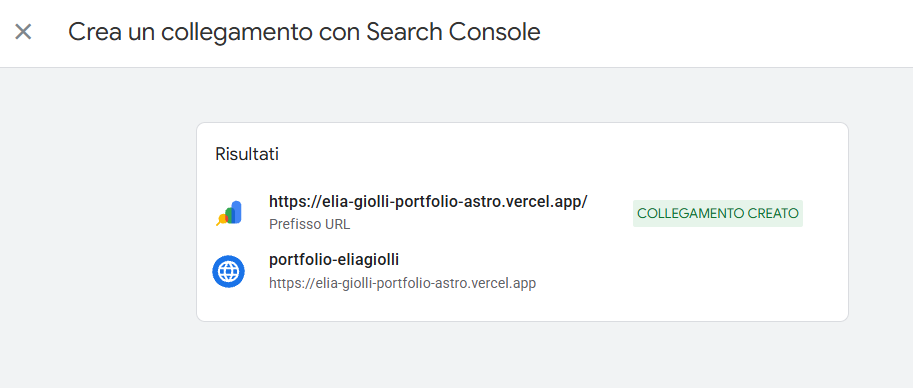

Nel [primo articolo](/blog/da-developer-a-seo-specialist/) ho raccontato perché sto passando dallo sviluppo front-end alla SEO tecnica. Qui passo alla pratica: tutto quello che ho configurato sul mio portfolio, costruito con Astro, per renderlo leggibile da Google e misurabile con Google Analytics 4. **Errori compresi**, perché sono la parte da cui si impara di più.

Se ti interessa la diagnosi iniziale, cioè cosa non andava prima, la trovi nel [case study dell'audit](/case-studies/audit-seo-tecnico-portfolio/). Questo articolo è il "come".

## 1. Il dominio prima di tutto

In Astro c'è un'opzione che sembra un dettaglio e invece regge tutta la SEO tecnica: `site`, in `astro.config.mjs`.

```js
export default defineConfig({
  site: "https://elia-giolli-portfolio-astro.vercel.app",
  integrations: [sitemap()],
});
```

Da questo valore vengono costruiti canonical, sitemap, `robots.txt`, feed RSS e anteprime social. Al primo deploy avevo lasciato un dominio segnaposto: mancava solo `-astro`, ma è bastato perché **ogni pagina dichiarasse a Google un URL ufficiale inesistente**. Il sito funzionava benissimo per un utente, e nessuno se ne sarebbe accorto senza aprire il codice sorgente.

Lezione: dopo ogni deploy controlla il canonical nell'HTML della pagina, non solo che il sito si apra.

## 2. Canonical e slash finale

Per un motore di ricerca `/blog` e `/blog/` sono due URL diversi. Se entrambi rispondono, il rischio è di avere due copie della stessa pagina in competizione tra loro.

Astro genera le pagine come cartelle e la sitemap le elenca con lo slash finale, quindi ho fatto lo stesso con il canonical: **un solo URL per ogni contenuto**, identico ovunque compaia (canonical, sitemap, RSS, link interni).

## 3. Sitemap e robots.txt

- La **sitemap** la genera l'integrazione ufficiale `@astrojs/sitemap` a ogni build, quindi un nuovo articolo ci finisce dentro da solo.
- Il **robots.txt** non è un file statico: è un piccolo endpoint che legge il dominio dalla configurazione. Così, se un giorno passerò a un dominio personale, dovrò cambiarlo in un solo punto.

```ts
export const GET: APIRoute = ({ site }) => {
  const sitemapUrl = new URL("sitemap-index.xml", site);
  return new Response(`User-agent: *\nAllow: /\n\nSitemap: ${sitemapUrl.href}\n`);
};
```

## 4. Metadati e anteprime social

Prima ogni pagina aveva lo stesso `<title>` e la stessa description. Ora un unico componente nel layout riceve titolo e descrizione di ogni pagina e genera da solo:

- `<title>` e meta description univoci;
- canonical e meta robots (`noindex` solo sulla pagina 404);
- tag **Open Graph** e Twitter Card con un'immagine dedicata da 1200×630 px.

Un dettaglio che riguarda chi usa LinkedIn: **LinkedIn mette in cache l'anteprima** di un link. Quando ho cambiato titolo e immagine, il vecchio testo restava visibile. La soluzione è il [Post Inspector](https://www.linkedin.com/post-inspector/): incolli l'URL e LinkedIn rilegge la pagina.

## 5. Dati strutturati

Con il JSON-LD dici esplicitamente a Google cosa contiene una pagina, invece di lasciarglielo dedurre. Sul sito ne uso tre tipi:

- **Person** sulla home: chi sono, il ruolo, le competenze, i profili LinkedIn e GitHub;
- **BlogPosting** su ogni articolo: autore, data di pubblicazione e di aggiornamento;
- **BreadcrumbList** su blog e case studies, insieme alle breadcrumb visibili.

```json
{
  "@context": "https://schema.org",
  "@type": "BlogPosting",
  "headline": "SEO tecnica in pratica",
  "datePublished": "2026-10-06T00:00:00.000Z",
  "author": { "@type": "Person", "name": "Elia Giolli" }
}
```

Lo schema viene costruito dai dati dell'articolo, non scritto a mano: se cambio la data o il titolo, si aggiorna da solo. Per controllarlo uso il [Rich Results Test](https://search.google.com/test/rich-results) di Google.

## 6. HTML semantico e Core Web Vitals

- **Un solo `h1` per pagina.** Nella navbar c'era un secondo `h1` nascosto, invisibile per l'utente ma non per un crawler.
- **Font senza blocchi.** Il font del sito era caricato con un `@import` dentro il CSS: il browser doveva scaricare il CSS, leggerlo e solo dopo chiedere il font. Ora i font (Figtree e DM Mono, dopo il restyling) arrivano con `<link>` e `preconnect`, e le richieste partono in parallelo. Meno attesa per il primo contenuto visibile (LCP).
- **Immagini ottimizzate.** Astro converte le immagini in WebP e scrive larghezza e altezza nell'HTML, così la pagina non "salta" mentre si caricano (CLS). Le immagini dei certificati sono passate da circa 300-340 kB a poche decine di kB ciascuna.

## 7. GA4 senza cookie prima del consenso

Qui ho fatto una scelta precisa: **Google Analytics viene scaricato solo dopo che il visitatore clicca "Accetta"** nel banner cookie (Consent Mode v2 in modalità "basic"). Prima del consenso non parte nessuna richiesta verso Google, il che è più rispettoso del GDPR e alleggerisce la pagina per chi rifiuta.

Questa scelta ha una conseguenza che mi ha fatto perdere qualche minuto: il controllo automatico di GA4 **non trova il tag**, perché scarica la pagina senza cliccare il banner.



*L'avviso di GA4. Nascondeva due problemi: uno atteso (il tag dietro consenso), uno vero (l'URL "vercel.com").*

Guardando meglio, l'avviso diceva un'altra cosa importante: GA4 cercava il tag su **vercel.com**, cioè sul sito di Vercel, non sul mio. Avevo configurato lo stream di dati con l'URL sbagliato. Corretto l'URL, ho notato un secondo errore: lo stream giusto aveva un **ID di misurazione diverso** da quello che avevo inserito nel sito, che apparteneva allo stream vecchio.



*Lo stream corretto: URL del portfolio e il suo ID di misurazione. Sul sito deve esserci esattamente questo ID.*

Allineato l'ID, la verifica vera è stata il report **Tempo reale**: apro il sito in incognito, accetto il banner e controllo che la visita compaia.



*Le prime visite registrate in tempo reale: il consenso funziona e i dati arrivano allo stream giusto.*

Se fai la stessa prova, disattiva l'ad blocker: molti bloccano Google Analytics e la tua visita non comparirebbe.

## 8. Google Search Console

Search Console è lo strumento che mostra come Google vede il sito: pagine indicizzate, query di ricerca, errori. I passaggi che ho seguito:

1. **Proprietà "Prefisso URL"**, non "Dominio": la proprietà Dominio richiede di modificare i DNS, impossibile su un sottodominio `.vercel.app`.
2. **Verifica con tag HTML.** Il metodo "Google Analytics" non funziona sul mio sito per lo stesso motivo di prima: il tag di GA si carica solo dopo il consenso. Il token di verifica è nel layout, quindi è presente in ogni pagina.
3. **Invio della sitemap**: basta scrivere `sitemap-index.xml`, il resto lo trova Google.
4. **Richiesta di indicizzazione** dallo strumento Controllo URL. Sorpresa: su un sito nuovo il limite era di **una richiesta al giorno**. Ho scelto la home; le altre pagine le aggiungo nei prossimi giorni, e comunque la sitemap le farà scoprire.
5. **Collegamento con GA4**, per vedere le query di ricerca direttamente dentro Analytics.



*GA4 e Search Console collegati: da qui in poi comportamento degli utenti e dati di ricerca si leggono insieme.*

## La checklist che userò su ogni sito

- [ ] Dominio di produzione corretto nella configurazione, canonical verificato nell'HTML live
- [ ] Un solo URL per contenuto (attenzione allo slash finale)
- [ ] Sitemap generata automaticamente e `robots.txt` che la indica
- [ ] Title e description univoci, Open Graph con immagine 1200×630
- [ ] Dati strutturati verificati con il Rich Results Test
- [ ] Un solo `h1`, font e immagini che non bloccano il rendering
- [ ] Analytics solo dopo il consenso, verificato in Tempo reale e senza ad blocker
- [ ] Search Console: proprietà verificata, sitemap inviata, collegamento con GA4

Il prossimo passo è misurare: tra qualche settimana guarderò i primi dati di Search Console e i punteggi di PageSpeed Insights, e li aggiungerò al case study.

E tu? **Qual è l'errore di configurazione che ti ha fatto perdere più tempo su un sito?** Il mio, per ora, è il dominio segnaposto dimenticato nel canonical.
